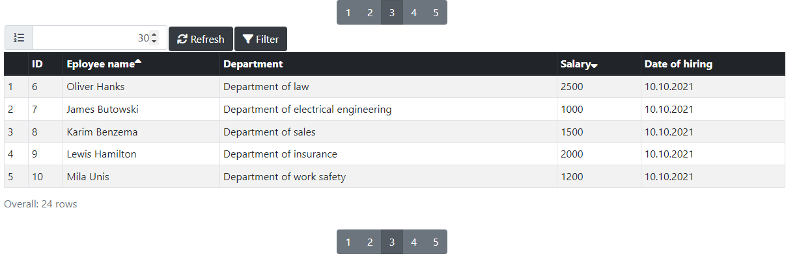

# EasyTable library

JS-library for table drawing.

Usage
```
<script type="text/javascript" src="EasyTable.js" />
<script type="text/javascript" src="https://code.jquery.com/jquery-3.6.1.min.js"></script>
<script type="text/javascript" src="js/bootstrap.min.js"></script>
<link rel="stylesheet" type="text/css" href="css/bootstrap.min.css" />
<link rel="stylesheet" type="text/css" href="css/fa/css/all.css" />
<link rel="stylesheet" type="text/css" href="css/table.css" />
<script type="text/javascript">
	var result = {
		page: 2,
		size: 30,
		totalPages: 5,
		totalElements: 24,
		sort: [
			{
				field: "name",
				order: "ASC"
			},
			{
				field: "salary",
				order: "DESC"
			}
		],
		data: [
			{
				id: 6,
				name: "Oliver Hanks",
				dep_id: 1,
				dep_name: "Department of law",
				salary: 2500,
				hired_date: "10.10.2021"
			}
			....
		]
	}

	function getData(paging, filtering, onDataReceived) {
		onDataReceived(result);
	}
</script>
<div style="margin: auto; width: 1200px;">
	<EzTable name="Employees" getData="getData()" enableNumeration="true">
		<column name="id" title="ID" format="number">
			<filter label="Identification number"></filter>
		</column>
		<column name="name" title="Eployee name">
			<filter operator="like"></filter>
		</column>
		<column name="dep_id" hidden> 
			<filter operator="option" 
				options="[{name: 'Department of law', value: 1},{name: 'Department of electrical engineering', value: 2},{name: 'Department of sales', value: 3},{name: 'Department of insurance', value: 4},{name: 'Department of work safety', value: 5}]"
				label="Department"></filter>
		</column>
		<column name="dep_name" title="Department"> </column>
		<column name="salary" title="Salary" format="number" >
			<filter operator="range"></filter>
		</column>
		<column name="hired_date" title="Date of hiring" format="date"> </column>
	</EzTable>
</div>
```

This will show the table:


Dependencies:
- Bootstrap 4
- JQuery 3.6.*